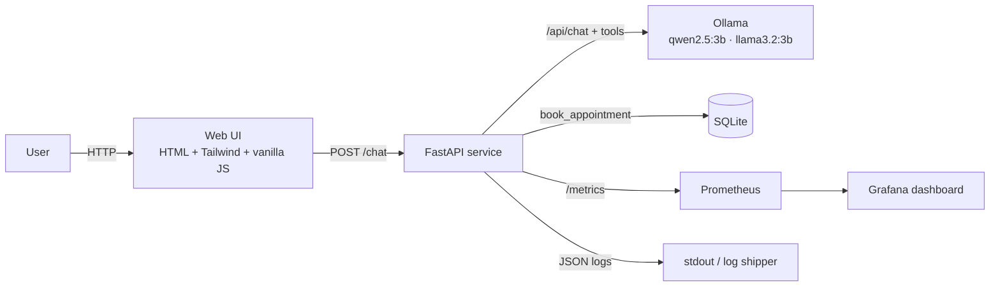

# Barbershop Assistant AI

> Production-grade LLM assistant for barbershops, with full MLOps observability and a multi-model benchmark — all running on local hardware.

[](.github/workflows/ci.yml)
[](https://www.python.org/)
[](docker-compose.yml)
[](LICENSE)

---

## What this is

A self-hosted conversational AI that handles a barbershop's front-desk interactions: pricing, hours, services, and **appointment booking via LLM tool calling**. No third-party APIs. No data leaving the server.

The project is built as an **MLOps showcase**: every component is containerized, observed, evaluated, and deployable with one command.

## Why it matters

Small businesses lose customers when they can't reply fast enough — a barber cutting hair cannot answer WhatsApp at the same time. This system handles the conversation, books appointments, and escalates only when needed. It runs on a single VPS or laptop with **no recurring API costs**.

## What it demonstrates

| Capability | Implementation |
|---|---|
| **Local LLM serving** | Ollama running two open models (`qwen2.5:3b`, `llama3.2:3b`) on CPU |
| **Prompt Engineering** | Versioned system prompt in `app/prompts/` with persona, scope, guardrails and few-shot examples |
| **Agentic tool calling** | LLM decides when to invoke `book_appointment(name, service, datetime, contact)`; result persisted to SQLite |
| **Truth analysis** | `eval/run_eval.py` runs a labeled dataset against both models and produces an accuracy + latency benchmark |
| **Multi-model A/B** | Model is selectable per request (`?model=...`) — same path used by both the UI and the benchmark |
| **Observability** | Structured JSON logs + Prometheus metrics (`/metrics`) + pre-built Grafana dashboard |
| **Containerization** | One `docker compose up` brings up Ollama, the app, Prometheus and Grafana with healthchecks |
| **CI/CD** | GitHub Actions: ruff lint → pytest → Docker build, with layer caching |
| **Tests** | Unit tests for tools and metrics, integration tests for HTTP endpoints — no LLM round-trips needed |

---

## Architecture



**Design principles:**
- **Stateless server.** Conversation history lives in the client; the API holds no session state. Scales horizontally with zero coordination.
- **System prompt as code.** Editing `app/prompts/barber_system.md` is a regular pull request — diffable, reviewable, re-evaluated by the benchmark.
- **Two-phase agent loop.** Model emits `tool_calls` → server executes → server re-prompts the model with the tool result so it can phrase the confirmation in natural language.
- **Versioned metrics.** Every `/chat` request increments counters and records histograms — no separate APM agent needed.

---

## Quick start

```bash
git clone <this-repo>
cd barbershop-assistant-ai
docker compose up -d

# Pull the models inside the Ollama container (one-time, ~4 GB)
docker exec barber-ollama ollama pull qwen2.5:3b
docker exec barber-ollama ollama pull llama3.2:3b

# Open the chat
open http://localhost:8000

# Prometheus
open http://localhost:9091

# Grafana (admin / admin)
open http://localhost:3001
```

A health check:

```bash
curl http://localhost:8000/health
# {"status":"ok","default_model":"qwen2.5:3b"}
```

A booking conversation:

```bash
curl -X POST http://localhost:8000/chat -H "Content-Type: application/json" -d '{
  "messages": [
    {"role": "user", "content": "Hi, I want a classic haircut tomorrow at 11am. Name John Smith, phone +34611222333"}
  ]
}'
```

---

## Tech stack

| Layer | Choice | Why |
|---|---|---|
| LLM runtime | **Ollama** | Single binary, HTTP API, model management, swappable for vLLM / TGI |
| Backend | **FastAPI + httpx (async)** | Industry-standard Python async stack; non-blocking LLM calls |
| Validation | **Pydantic v2** | Typed request/response; auto-generated OpenAPI |
| Frontend | **HTML + Tailwind CDN + vanilla JS** | Zero build step, easy to understand, mobile-first |
| Persistence | **SQLite** | Single file, no extra service; trivially upgradable to Postgres |
| Metrics | **prometheus_client** | The Prometheus reference Python lib |
| Dashboards | **Grafana 11** | Pre-provisioned dashboard JSON in `monitoring/` |
| Logging | **structlog** | JSON output ready for Loki / Datadog / ELK |
| Containers | **Docker Compose** | Reproducible local stack |
| CI | **GitHub Actions** | Lint, test, build with cache |
| Tests | **pytest** + FastAPI TestClient | LLM-independent — runs in seconds |
| Lint | **ruff** | Fast, batteries-included |

---

## Project layout

```
barbershop-assistant-ai/
├── app/
│   ├── main.py              FastAPI app with chat + tools + metrics
│   ├── llm_client.py        Async wrapper around Ollama's /api/chat
│   ├── tools.py             book_appointment + SQLite + JSON tool schema
│   ├── metrics.py           Prometheus counters and histograms
│   ├── logging_config.py    structlog JSON setup
│   └── prompts/
│       └── barber_system.md System prompt (versioned)
├── web/
│   ├── index.html           Mobile-first chat UI
│   └── app.js               Conversation client, model selector, metrics overlay
├── eval/
│   ├── dataset.jsonl        20 labeled Q&A pairs across 7 categories
│   ├── run_eval.py          Multi-model runner producing CSV + Markdown report
│   ├── benchmark_report.md  Latest published comparison
│   └── results/             Per-model raw CSVs
├── monitoring/
│   ├── prometheus.yml       Scrape config
│   └── grafana-dashboard.json
├── tests/
│   ├── test_health.py       FastAPI endpoints — no Ollama required
│   ├── test_tools.py        SQLite + book_appointment logic
│   └── test_metrics.py      Prometheus rendering
├── Dockerfile
├── docker-compose.yml
├── requirements.txt
├── pyproject.toml           ruff + pytest configuration
└── .github/workflows/ci.yml
```

---

## Multi-model benchmark (truth analysis)

A core requirement for MLOps roles is the ability to **evaluate** models against a labeled dataset and compare them objectively.

The benchmark covers 7 categories: `pricing`, `hours`, `location`, `services`, `booking`, `refusal`, and `language`. Each item has rule-based grading (must contain certain tokens, must not contain others).

```bash
# Full benchmark on both models
python eval/run_eval.py

# Quick smoke run
python eval/run_eval.py --limit 3
```

The runner writes per-model CSVs to `eval/results/` and a publishable `eval/benchmark_report.md` with headline accuracy, latency p50/p95, and tokens/s.

> **CPU performance note.** This stack runs entirely on CPU. Expect 0.3 – 1.7 tokens/s and 30–90 s end-to-end per response. On a single GPU you would see 30–100x speedups. The bottleneck is identified and quantified — exactly the kind of operational reasoning an MLOps Engineer is hired for.

See [`eval/benchmark_report.md`](eval/benchmark_report.md) for the current results.

---

## Observability

Three signals shipped from day one:

**1. Structured JSON logs** (stdout) — `request_id`, model, latency, tokens, tool calls. Easy to ship into Loki or Datadog.

**2. Prometheus metrics** (`/metrics`):

| Metric | Type | Labels |
|---|---|---|
| `llm_requests_total` | counter | `model`, `status` |
| `llm_request_duration_seconds` | histogram | `model` |
| `llm_generation_duration_seconds` | histogram | `model` |
| `llm_tokens_total` | counter | `model`, `kind` (prompt/output) |
| `llm_tokens_per_second` | histogram | `model` |
| `llm_tool_calls_total` | counter | `tool`, `status` |
| `app_info` | gauge | `version` |

**3. Grafana dashboard** (`monitoring/grafana-dashboard.json`):
- Requests per second by model
- Request latency p50 / p95
- Tokens per second by model
- Output token rate
- Error rate (with thresholds)
- Tool-call counts
- Lifetime token totals

The dashboard is provisioned automatically by `docker compose up`.

---

## What KeepCoding modules this exercises

| Module | Where it shows up in the code |
|---|---|
| M1 — Role and lifecycle | Whole project shape: dev → deploy → monitor → evaluate |
| M6 — Prompt Engineering | `app/prompts/barber_system.md` with persona, scope, guardrails, few-shot |
| M9 — LLMOps | Ollama as serving runtime, Prometheus + Grafana for monitoring, Docker for packaging |
| M14 — Agents with tools | Two-phase tool loop in `chat_endpoint`; OpenAI-compatible JSON tool schema |
| M16 — Evaluation | Labeled dataset + automated runner + published benchmark |

Deliberately out of scope for V1 (kept for roadmap below):
RAG (M13), embeddings (M12), fine-tuning (M7), DSPy (M6 advanced).

---

## Roadmap

- [x] **V1** — Local LLMs + tool calling + observability + benchmark *(this release)*
- [ ] **V2** — Real Google Calendar integration via OAuth
- [ ] **V3** — RAG over the barbershop's services catalog and FAQs
- [ ] **V4** — Multi-tenant deployment, one isolated DB per shop
- [ ] **V5** — Drift detection — alert when daily eval accuracy drops below a threshold

---

## About this project

Built as a portfolio piece during the **KeepCoding Advanced AI Engineering** program (2026).

The goal is to demonstrate, end to end, the skills required for an MLOps / AI Engineer role — from LLM integration to production observability — using a real, concrete business case.

## License

MIT
